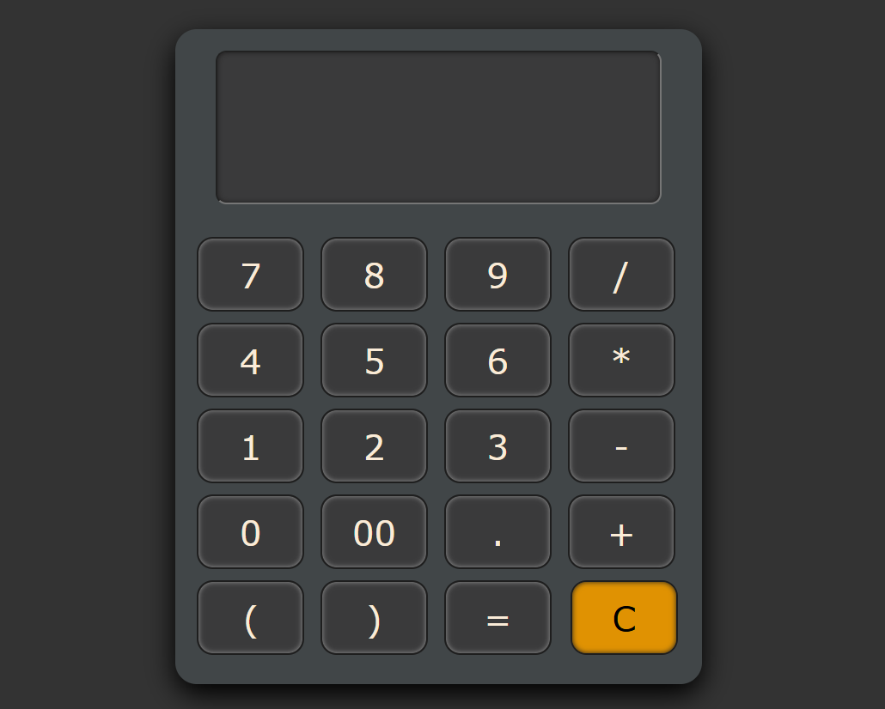

# 🧮 Basic Calculator

A simple, responsive calculator built using **HTML**, **CSS**, and **JavaScript**. It allows users to perform basic arithmetic operations following **BODMAS rules** and includes brackets, decimal support, and a clear display interface.

---

## 📌 Features

- Addition, Subtraction, Multiplication, Division
- BODMAS rule support (with brackets)
- Clear (`C`)
- Modern UI using CSS Grid
- Responsive display
- Keyboard support

---

## 🛠️ Technologies Used

- **HTML5** – Structure of the calculator
- **CSS3** – Styling and layout (Grid)
- **JavaScript** – Button handling, display update, expression evaluation, and keyboard support

---

## 💻 Live Preview

> https://github.com/hkk0721/Basic-calculator

---

## 📷 Screenshots

> 

---

## 🚀 How to Use

1. Clone or download this repository:

```bash
git clone https://github.com/hkk0721/Basic-calculator.git

